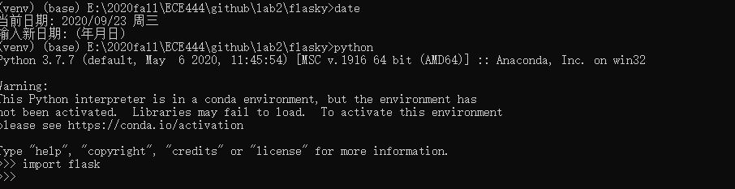

# ECE444-F2020-Lab2
This repo is a clone of https://github.com/miguelgrinberg/flasky

Activity 1:

Activity 2:

Activity 3: 
The flask context global including the application context and the request context. It enable Flask to make certain variables globally accessible to a thread without interfering with the other threads.
In this example, there is a variable exposed by application context which is appJX which carries the app instance.
There are more variable can be exposed by application context including g which is an object that the application can use for temporary storage during the handling of a request. This variable is reset with each request.
There are two variable exposed by request context including request which encapsulates the contents of a HTTP request sent by the client. And session which is a dictionary that the application can use to store values that are “remembered” between requests.

